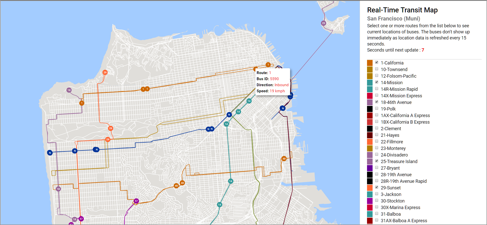

# Real-Time Transit Map (SF Muni)
A transit map showing (almost) real-time transit data obtained from the [NextBus XML Feed](https://www.nextbus.com/xmlFeedDocs/NextBusXMLFeed.pdf). The bus locations update once every 15 seconds. Select one or more routes to see the bus locations.

## Live Demo
For a live demo, [click here](http://www.terpconnect.umd.edu/~senthilc/sf-transit/).

### To run locally
To run this code locally, you'll need to start a local server at the directory containing index.html, since the js file accesses some local data files (from the data/ folder).
